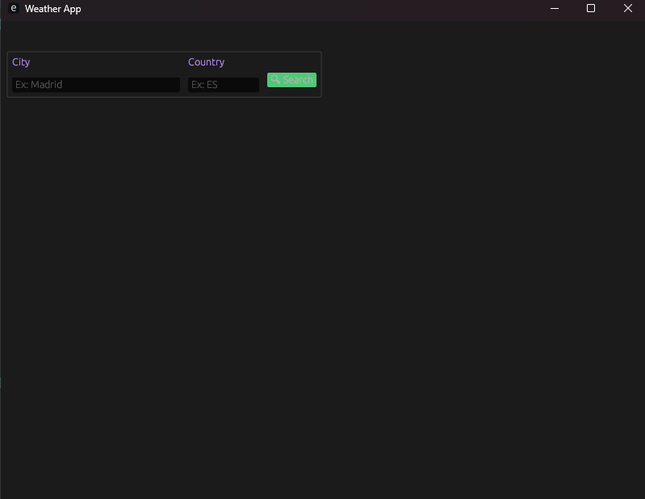
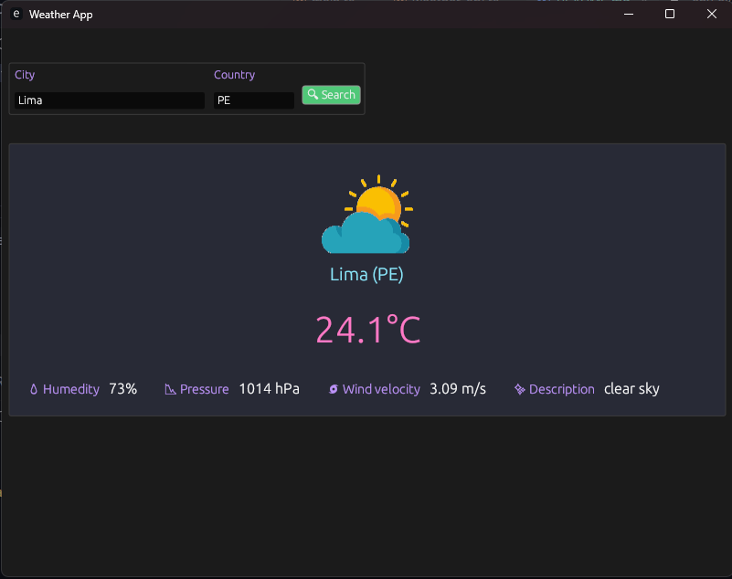

# Weather API

## Description
This project is a Weather API that fetches and returns weather data from a third-party API instead of relying on our own weather data. It helps me in understanding how to work with third-party APIs, caching mechanisms, and environment variables.
# Preview



## Features
- Fetches real-time weather data from a third-party API (e.g., OpenWeather API).
- Implements in-memory caching using Redis to store recent requests and reduce API calls.
- Uses environment variables to securely store sensitive information like API keys.
- Implements proper error handling for invalid requests and third-party API failures.
- Supports rate limiting to prevent abuse.
- Includes a GUI for user-friendly interaction.

## Technologies Used
- Programming Language: Rust
- Third-party API: [Open Weather API](https://openweathermap.org/current)
- Caching: Redis
- HTTP Requests: Reqwest
- GUI:  Egui
- Environment Variable Management: dotenv
- Rate Limiting:  Custom implementation using Redis

## Setup and Installation
### Prerequisites
- Install Redis and start service
- Obtain an API key from Open Weather (or any chosen weather API)

### Installation Steps
1. Clone the repository:
   ```sh
   git clone https://github.com/cenixeriadev/WeatherAPI.git
   cd WeatherAPI
   ```
2. Install dependencies:
   ```sh
   cargo build
   ```
3. Set up environment variables:
   Create a `.env` file and add the following:
   ```env
   API_KEY=your_openweather_api_key
   REDIS_URL=your_redis_connection_string
   ```
4. Start the application:
   ```sh
   cargo run
   ```

## API Endpoints
### Get Weather Data
- **Endpoint:** `GET /weather/:city/:country_code`
- **Description:** Fetches weather data for a given city and country code(Ex: US).
- **Response:**
  ```json
  {
     "city": "New York",
     "temperature": "15°C",
     "humidity": 60,
     "pressure": 1013,
     "wind_speed": 5.0,
     "description": "Clear sky"
  }
  ```

## Caching Strategy
- The city and country code entered by the user is used as the cache key.
- Weather data is stored in Redis with a 12-hour expiration time to avoid stale data.

## Error Handling
- Handles invalid city and country codes and returns appropriate error messages.
- If the third-party API is down, returns a suitable fallback response.

## Rate Limiting
- To prevent API abuse, a rate limiter is implemented using Redis.
- Allows a maximum of 15 requests per minute per city-country pair.

## Road Map Project
- Link: https://roadmap.sh/projects/weather-api-wrapper-service

## Author
- Anthony (GitHub: [cenixeriadev](https://github.com/cenixeriadev))

